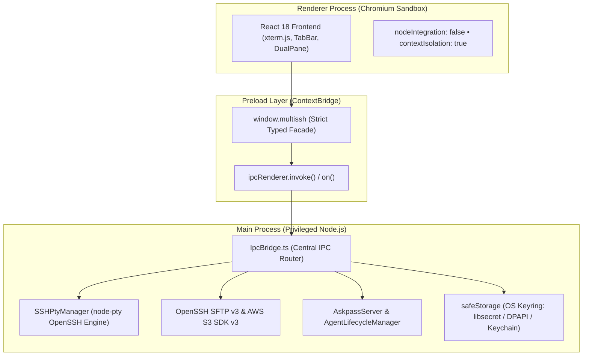

## Architecture, Security Model & System Internals

This chapter documents the internal architecture, multi-process isolation model, active Electron Fuses, and complete IPC contracts of **sshs3**. The IPC table is autogenerated directly from application source code ([`src/shared/types/ipc.ts`](file:///home/alun/sshs3/src/shared/types/ipc.ts)) and is intended for security auditors, penetration testers, and systems engineers.

---

## 1. Three-Process Architecture & Sandboxing

sshs3 is built on Electron's multi-process model with strict separation of privilege between the presentation layer and system execution engines:

### Architectural Security Guarantees
1. **Zero Node.js Access in Renderer**: The user interface has zero direct access to Node.js primitives (`fs`, `child_process`, `net`, `electron`). All operations must navigate the typed IPC contract.
2. **Fail-Closed Security Design**: If the user interface unmounts or fails to respond to host key validation (TOFU) or PIN prompts within the timeout window, the operation aborts automatically.
3. **Atomic Persistence**: All internal state stores (`ProfileStore`, `SettingsStore`, `SessionStore`) employ sequential `queueMutation` promises to ensure atomic disk writes via temporary files.
4. **App-Wide `AppAgent` & Concurrent Agent Lifecycle**: `AgentLifecycleManager` probes for a running agent via `ensureAgent()`. Concurrent startup callers (such as restored local shell tabs racing startup initialization) coalesce onto the same in-flight promise to prevent PTY environment race conditions. In Global PIN caching mode, the app runs a single app-wide agent (`AppAgent`) with a stable socket (`$XDG_RUNTIME_DIR/sshs3/agent.sock` or `/tmp/sshs3-agent-<uid>/agent.sock`, `0700`), exposed to external terminals via a serialized, injection-safe `# BEGIN sshs3-agent` block in `~/.ssh/config`.

---

## 2. Electron Fuses & Binary Hardening

During production packaging, hardware-level **Electron Fuses** are enforced via `electron-builder.json`:

| Electron Fuse | Status | Security Rationale |
| :--- | :--- | :--- |
| `runAsNode` | **Enabled (Restricted)** | Required for internal auxiliary processes (`askpass`, `certWorker.cjs`, proxy CLI) to execute through the signed binary via `ELECTRON_RUN_AS_NODE=1`. |
| `enableNodeCliInspectArguments` | **Disabled (Locked)** | Prevents an attacker from attaching a debugger (`--inspect`, `--inspect-brk`) to the main process to inspect memory. |
| `enableNodeOptionsEnvironmentVariable` | **Disabled (Locked)** | Blocks arbitrary code injection via the `NODE_OPTIONS` environment variable. |
| `onlyLoadAppFromAsar` | **Enabled (Locked)** | Forces Electron to execute exclusively from inside the packaged `app.asar` archive. |

---

## 3. Threat Model & Asset Protection Matrix

| Asset / Secret | Storage Location | In-Memory Lifetime | Protection Mechanism |
| :--- | :--- | :--- | :--- |
| **Private SSH Keys** | Hardware Token / Disk | **Never in app memory** | Zero Private Key Extraction. OpenSSH executes signing on the hardware chip or system PTY. |
| **Smartcard PINs** | Ephemeral in `AskpassServer` | Ephemeral (seconds to session) | Purged immediately after handshake in Always Prompt mode. Never written to disk. |
| **Saved Profile Passwords** | `profiles.json` on disk | Decrypted only at connect time | Encrypted with AES via Electron `safeStorage` (libsecret on Linux, DPAPI on Windows, Keychain on macOS). |
| **Remote Vault Profiles** | Remote S3 / SFTP server | Lifetime of sync session | Client-side encrypted with **AES-256-GCM** and scrypt. Remote server sees only opaque ciphertext. |
| **Forwarded X11 Windows** | VcXsrv TCP Port 6000 | Lifetime of session | Access control enforced; requires `MIT-MAGIC-COOKIE`. Unauthorized LAN devices are rejected. |
| **AI API key** | `ai-config.json` on disk | Decrypted per request in the main process | Encrypted with `safeStorage`; never sent to the renderer or synced. Passed to the bundled Hermes agent only through its process environment, never written to its files. |
| **Bundled Hermes agent** | Loopback port (random) + `userData/hermes` | While AI requests use it | Bound to `127.0.0.1` with a random per-start bearer key. Only memory, session search and to-do tools; shell commands denied. Started with an allowlisted environment, so no SSH agent socket, cloud credentials or user home. |

---

## 4. Complete Autogenerated IPC Channel Reference

> [!NOTE]
> The table below is **autogenerated directly from the application source code** ([`src/shared/types/ipc.ts`](file:///home/alun/sshs3/src/shared/types/ipc.ts)) during every documentation build. It enumerates all typed channels between the renderer and main process.

{{AUTOGENERATED_IPC_TABLE}}

---

## 5. Troubleshooting & Diagnostics Runbook

| Symptom / Error Message | Probable Root Cause | Corrective Action |
| :--- | :--- | :--- |
| `IPC channel not registered` | Version mismatch between renderer and main | Verify `IpcBridge.ts` registers a handler matching the channel constant. |
| `safeStorage is not available` | Operating system keyring service is not running | In headless Linux setups, ensure `gnome-keyring` or a compatible Secret Service daemon is active. |
| `ELECTRON_RUN_AS_NODE rejected` | Binary fuses were modified or corrupted | Validate binary fuses using `npx @electron/fuses read --app <path-to-binary>`. |
